# Diagrama Entidad-Relación - Sistema Buen Sabor

```mermaid
erDiagram
    %% ========== ENTIDADES DE HERENCIA ==========
    Articulo {
        Long id PK
        String nombre
        BigDecimal precioVenta
        BigDecimal precioCosto
        Boolean activo
        Boolean esVendible
        Integer tiempoEstimadoMinutos
        Float margen
        Long categoria_id FK
        Long unidad_medida_id FK
        Long unidad_medidaEnum_id FK
    }
    
    ArticuloInsumo {
        Long id PK
        Double stockActual
        Double stockMaximo
        Double stockMinimo
        Double stockReservado
    }
    
    ArticuloManufacturado {
        Long id PK
        String descripcion
        String preparacion
    }
    
    Promocion {
        Long id PK
        LocalDate fechaDesde
        LocalDate fechaHasta
        LocalTime horaDesde
        LocalTime horaHasta
        String descripcionDescuento
        BigDecimal precioTotal
    }
    
    Usuario {
        Long id_usuario PK
        String nombre
        String apellido
        String usuario
        String password
        String email
        String telefono
        LocalDateTime fechaRegistro
        Rol rol
        String oauth2Id
    }
    
    Cliente {
        Long id_usuario PK
        LocalDate fechaNacimiento
        Boolean activo
    }
    
    Empleado {
        Long id_usuario PK
        Boolean activo
    }
    
    Imagen {
        Long id PK
        String denominacion
        String urlImagen
    }
    
    ImagenArticulo {
        Long id PK
        Long articulo_id FK
    }
    
    ImagenPromocion {
        Long id PK
        Long promocion_id FK
    }
    
    ImagenUsuario {
        Long id PK
        Long usuario_id FK
    }
    
    %% ========== ENTIDADES GEOGRÁFICAS ==========
    Pais {
        Long id PK
        String nombre
    }
    
    Provincia {
        Long id PK
        String nombre
        Long pais_id FK
    }
    
    Localidad {
        Long id PK
        String nombre
        Long provincia_id FK
    }
    
    Domicilio {
        Long id_domicilio PK
        String calle
        String alias
        Integer numero
        String codigoPostal
        String piso
        String departamento
        Boolean activo
        Long localidad_id FK
    }
    
    %% ========== ENTIDADES DE NEGOCIO ==========
    Empresa {
        Long Id PK
        String nombre
        String razonSocial
        Integer cuit
    }
    
    Sucursal {
        Long id_sucursal PK
        String nombre
        LocalTime horarioApertura
        LocalTime horarioCierre
        Boolean activo
        Long empresa_id FK
        Long domicilio_id FK
    }
    
    Categoria {
        Long id PK
        String denominacion
        Boolean activo
        Long categoria_padre_id FK
    }
    
    UnidadMedida {
        Long id_unidadMedida PK
        String denominacion
        Double factor
    }
    
    %% ========== ENTIDADES DE DETALLES ==========
    ArticuloManufacturadoDetalle {
        Long id_articuloManufacturadoDetalle PK
        Double cantidad
        Long articulo_insumo_id FK
        Long articulo_manufacturado_id FK
    }
    
    PromocionDetalle {
        Long id_promocion PK
        Integer cantidad
        Long articulo_id FK
        Long promocion_id FK
    }
    
    %% ========== ENTIDADES DE PEDIDOS ==========
    Pedido {
        Long id PK
        LocalTime horaEstimadaFinalizacion
        Estado estadoPedido
        Estado estadoPago
        TipoEnvio tipoEnvio
        FormaPago formaPago
        LocalDate fechaPedido
        BigDecimal costoTotal
        BigDecimal total
        BigDecimal gastosEnvio
        String aclaracionDomicilio
        String domicilioSnapshot
        Long sucursal_id FK
        Long domicilio_id FK
        Long cliente_id FK
        Long factura_id FK
    }
    
    DetallePedido {
        Long id_detallePedido PK
        Integer cantidad
        BigDecimal subtotal
        Long pedido_id FK
        Long articulo_id FK
    }
    
    Factura {
        Long id PK
        LocalDate fechaFacturacion
        Estado estadoPago
        FormaPago formaPago
        BigDecimal totalVenta
        Long numeroComprobante
        Long pedido_id FK
    }
    
    DetalleFactura {
        Long id PK
        Integer cantidad
        BigDecimal subTotal
        Long factura_id FK
        Long articulo_id FK
        Long promocion_id FK
    }
    
    DetalleMercadoPago {
        Long id PK
        Integer id_Pago
        Integer id_Orden
        String idPreferencia
        String tipoPago
    }
    
    %% ========== TABLA DE UNION MANY-TO-MANY ==========
    articulo_promocion {
        Long articulo_id FK
        Long promocion_id FK
    }
    
    cliente_domicilio {
        Long cliente_id FK
        Long domicilio_id FK
    }
    
    %% ========== RELACIONES DE HERENCIA ==========
    Articulo ||--o{ ArticuloInsumo : "extends"
    Articulo ||--o{ ArticuloManufacturado : "extends"
    Articulo ||--o{ Promocion : "extends"
    
    Usuario ||--o{ Cliente : "extends"
    Usuario ||--o{ Empleado : "extends"
    
    Imagen ||--o{ ImagenArticulo : "extends"
    Imagen ||--o{ ImagenPromocion : "extends"
    Imagen ||--o{ ImagenUsuario : "extends"
    
    %% ========== RELACIONES ARTICULOS ==========
    Articulo }o--|| Categoria : "tiene"
    Articulo }o--o| UnidadMedida : "tiene"
    Articulo ||--o{ ImagenArticulo : "tiene"
    Articulo }o--o{ Promocion : "articulo_promocion"
    Articulo ||--o{ DetallePedido : "contiene"
    Articulo ||--o{ DetalleFactura : "contiene"
    Articulo ||--o{ PromocionDetalle : "contiene"
    
    ArticuloManufacturado ||--o{ ArticuloManufacturadoDetalle : "tiene"
    ArticuloManufacturadoDetalle }o--|| ArticuloInsumo : "requiere"
    
    Promocion ||--o{ PromocionDetalle : "tiene"
    Promocion ||--o{ ImagenPromocion : "tiene"
    
    %% ========== RELACIONES GEOGRÁFICAS ==========
    Pais ||--o{ Provincia : "contiene"
    Provincia ||--o{ Localidad : "contiene"
    Localidad ||--o{ Domicilio : "tiene"
    
    %% ========== RELACIONES DOMICILIO ==========
    Domicilio }o--|| Sucursal : "ubicacion"
    Domicilio }o--o{ Cliente : "cliente_domicilio"
    Domicilio }o--o{ Pedido : "entrega"
    
    %% ========== RELACIONES EMPRESA ==========
    Empresa ||--o{ Sucursal : "tiene"
    Sucursal }o--o{ Pedido : "procesa"
    
    %% ========== RELACIONES USUARIOS ==========
    Usuario ||--o{ ImagenUsuario : "tiene"
    Cliente ||--o{ Pedido : "realiza"
    
    %% ========== RELACIONES PEDIDOS ==========
    Pedido ||--o{ DetallePedido : "contiene"
    Pedido ||--|| Factura : "genera"
    Pedido }o--|| Cliente : "pertenece"
    Pedido }o--o| Domicilio : "entrega_en"
    Pedido }o--o| Sucursal : "procesa"
    
    Factura ||--o{ DetalleFactura : "contiene"
    Factura ||--o| DetalleMercadoPago : "tiene"
    DetalleFactura }o--o| Promocion : "incluye"
    
    %% ========== RELACIONES CATEGORIA ==========
    Categoria }o--o| Categoria : "categoriaPadre"
```

## Notas del Diagrama

### Herencia
- **Articulo**: Clase abstracta con herencia JOINED. Tiene 3 subclases: ArticuloInsumo, ArticuloManufacturado, Promocion
- **Usuario**: Clase base con herencia JOINED. Tiene 2 subclases: Cliente, Empleado
- **Imagen**: Clase abstracta con herencia JOINED. Tiene 3 subclases: ImagenArticulo, ImagenPromocion, ImagenUsuario

### Relaciones Many-to-Many
- **articulo_promocion**: Tabla de unión entre Articulo y Promocion
- **cliente_domicilio**: Tabla de unión entre Cliente y Domicilio

### Enums Utilizados
- **Estado**: estadoPedido, estadoPago
- **FormaPago**: formaPago
- **TipoEnvio**: tipoEnvio
- **Rol**: rol del usuario
- **UnidadMedidaEnum**: unidad de medida del artículo

### Cardinalidades Principales
- Un **Articulo** puede tener múltiples **ImagenArticulo** (1:N)
- Un **ArticuloManufacturado** tiene múltiples **ArticuloManufacturadoDetalle** (1:N)
- Un **Pedido** tiene múltiples **DetallePedido** (1:N)
- Un **Pedido** genera una **Factura** (1:1)
- Un **Cliente** puede tener múltiples **Domicilio** (N:M)
- Un **Cliente** realiza múltiples **Pedido** (1:N)
- Una **Categoria** puede tener subcategorías (auto-referencia 1:N)
